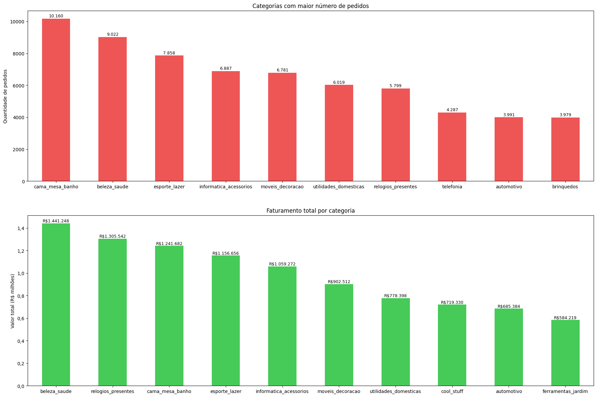

# Análise de Dados do E-Commerce da Olist

## Visão Geral
O projeto busca extrair e analisar os dados de venda do comércio digital da empresa brasileira Olist.

## Perguntas Que Busco Responder
- Quais áreas do país mais fizeram pedidos?
- Qual categoria de produtos gerou a maior receita?
- Quais categorias vendem mais?
- O número de vendas aumentou com o tempo?
- Como o Valor médio do pedido (AOV) mudou com o tempo?
- O quão preciso são as datas estimadas de entrega?

## Respostas
- **Áreas do país mais fizeram pedidos?**  
A região Sudeste domina as vendas (65,2%), em especial o estado de SP (41,2%)

- **Qual categoria gerou a maior receita? e qual vendeu mais em quantidade?**  
A categoria de 'beleza_saude' foi a que mais gerou receita, com 1,4 milhão de reais.
E a categoria 'casa_mesa_banho" foi a que mais teve pedidos, com 10.160 pedidos.

## Dataset
Este projeto usa de base o dataset: **Brazilian E-Commerce Public Dataset by Olist**, do Kaggle
https://www.kaggle.com/datasets/olistbr/brazilian-ecommerce

## Ferramentas Usadas
- SQL;
- Python (Pandas para análises e Matplotlib para gráficos).

## Nota
Criado para fins de aprendizado e portfólio por um estudante de ciência da computação da UFRJ.